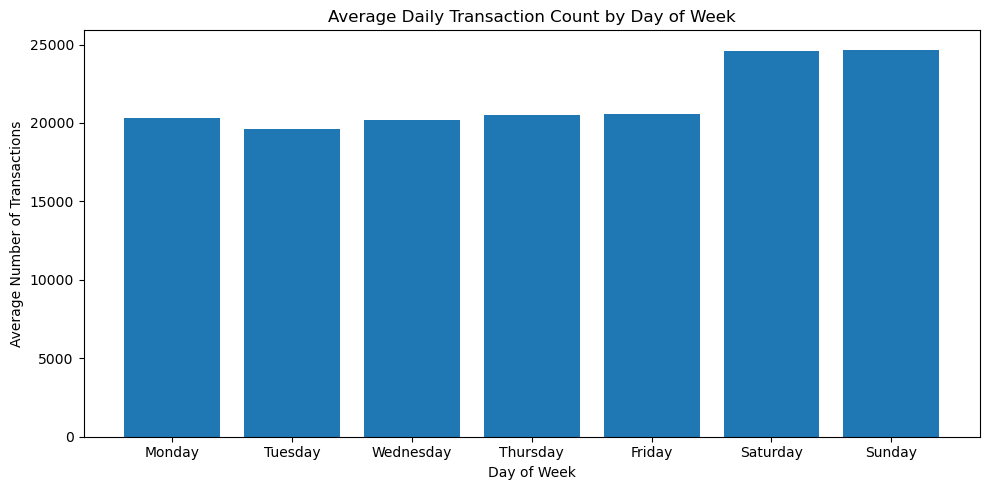
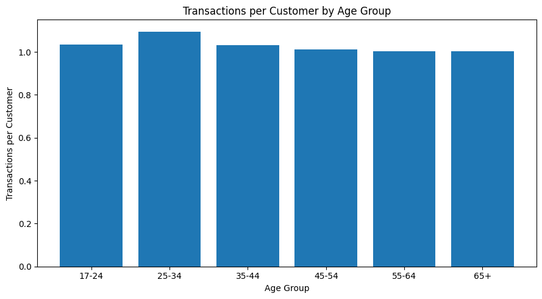
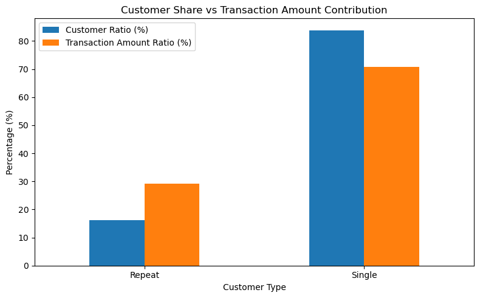

# Bank Customer Transaction Behavior & Customer Value Analysis
## 銀行客戶交易行為與客戶價值分析

## Project Overview

本專案使用銀行客戶交易資料，透過 Python 與 Pandas 進行資料清理、探索性資料分析（EDA）及客戶行為分析，從時間、年齡、性別與交易頻率等面向觀察客戶交易特徵，並進一步比較單次交易與重複交易客戶的交易價值。

分析目的為從交易資料中識別重要的客戶行為特徵，並將分析結果轉化為可供客群經營與業務決策參考的洞察。

---

## Business Questions

本專案主要探討以下問題：

1. 銀行整體交易金額與交易筆數呈現什麼特徵？
2. 不同日期與星期的交易活動是否存在差異？
3. 不同年齡與性別客群的交易行為有何差異？
4. 單次交易與重複交易客戶的交易價值是否有所不同？
5. 根據分析結果，可以提出哪些客群經營與業務應用方向？

---

## Dataset

原始資料包含約 **104 萬筆銀行交易紀錄**，主要欄位包括：

- Customer ID
- Customer Date of Birth
- Gender
- Customer Location
- Account Balance
- Transaction Date
- Transaction Time
- Transaction Amount

資料清理後共保留約 **104 萬筆交易資料**。

資料處理過程包含：

- 缺失值檢查與處理
- 重複資料檢查
- 日期格式轉換
- 異常出生日期處理
- 年齡與年齡群組建立
- 性別異常值處理
- 帳戶餘額與交易金額分布檢查
- 交易日期完整性檢查

---

## Analysis Process

### 1. Data Understanding & Cleaning

首先檢查資料型態、缺失值、重複資料及數值分布。

針對出生日期欄位中的占位值與兩位數年份問題進行處理，並建立 Age 與 AgeGroup 欄位。對於無法合理判讀的年齡資料則保留為缺失值，避免直接刪除完整交易紀錄。

此外，交易金額與帳戶餘額皆呈現明顯右偏分布，因此分析過程同時參考平均數與中位數，降低少數高額交易對解讀造成的影響。

### 2. Time Analysis

由於原始資料後段日期存在缺漏，時間趨勢分析採用日期連續完整的 **2016-08-01 至 2016-09-15**。

分析每日交易量及星期別交易行為，並比較平日與週末的交易差異。

### 3. Customer Analysis

從 Age Group 與 Gender 兩個面向分析客戶交易行為，並使用：

- Customer Count
- Transaction Count
- Transactions per Customer
- Average Transaction Amount
- Median Transaction Amount

避免僅以總交易筆數判斷客群活躍程度。

### 4. Customer Value Analysis

將交易資料彙總至 Customer ID 層級後，分析每位客戶的：

- Transaction Count
- Total Transaction Amount
- Average Transaction Amount

由於大部分客戶在觀察期間內僅有一筆交易，因此本專案未直接套用傳統 RFM 模型，而將客戶區分為：

- **Single**：僅有 1 筆交易
- **Repeat**：具有 2 筆以上交易

進一步比較兩類客戶的交易行為與交易金額貢獻。

---

## Key Findings

### 1. Weekend transaction activity is higher


在完整交易期間內，週末平均每日交易筆數約為 **24,638 筆**，較平日約 **20,220 筆高出 21.9%**。

此外，週末平均單筆交易金額較平日高約 **7.6%**。

因此週末較高的總交易金額同時受到交易筆數與單筆交易金額增加影響，其中交易筆數的增幅更加明顯。

### 2. Customers aged 25–34 show higher transaction activity


25–34 歲客群不僅具有最多的交易筆數，每位客戶平均交易次數亦為各年齡層最高，顯示其較高的交易量並非單純受到客戶人數較多影響。

65 歲以上客群雖具有最高的平均交易金額，但平均數明顯高於中位數，顯示其平均值可能受到少數高額交易影響，因此不宜直接解讀為該客群普遍具有最高的交易金額。

### 3. Gender groups show different transaction patterns

男性客戶每位客戶平均交易次數略高於女性。

另一方面，女性客戶的平均與中位交易金額皆高於男性，顯示女性客戶的單筆交易金額整體相對較高。

### 4. Repeat customers contribute disproportionately to transaction value


約 **83.9%** 的客戶在觀察期間內僅有一筆交易，而 Repeat 客戶僅占約 **16.1%**。

然而，Repeat 客戶貢獻約 **29.1%** 的總交易金額，高於其客戶人數占比。

此外，Repeat 與 Single 客戶的平均單筆交易金額相近，但 Repeat 客戶的中位交易金額較高：

| Customer Type | Median Transaction Amount |
|---|---:|
| Single | ₹457.52 |
| Repeat | ₹662.20 |

顯示典型的 Repeat 客戶具有相對較高的交易價值。

---

## Business Recommendations

### Weekend Customer Engagement

週末具有較高的交易活動，可進一步分析週末使用的產品、交易通路及交易類型，作為行銷活動時機、服務資源與系統容量配置的參考。

### Active Customer Segment

25–34 歲客群具有較高的交易活躍度，可進一步結合產品持有、交易通路與交易類型等資訊建立完整客戶輪廓，作為產品推薦與交叉銷售分析的潛在客群。

### Customer Segmentation

不同性別客群呈現不同的交易頻率與單筆交易金額特徵。若能進一步結合產品與交易用途資料，可分析不同客群的需求差異，作為客群經營策略的參考。

### Repeat Customer Value

Repeat 客戶雖占比較低，但交易金額貢獻高於其客戶人數占比。

後續可進一步分析 Repeat 客戶的產品使用、交易頻率與客戶特徵，以識別具有較高交易價值潛力的客群。

---

## Limitations

- 原始資料後段交易日期並不完整，因此時間趨勢分析僅採用日期連續完整的 2016-08-01 至 2016-09-15。
- 約 83.9% 的客戶在觀察期間內僅有一筆交易，因此資料不足以穩健衡量長期忠誠度、留存或流失行為，本專案未直接使用傳統 RFM 模型。
- 原始出生日期存在缺失值、占位值及兩位數年份造成的世紀判讀問題，因此年齡分析僅使用清理後可合理判讀的資料。
- Customer Location 存在大量不同文字值及可能的地名格式差異，因此未作為本次主要客群分群依據。
- 資料缺乏產品類型、交易通路與行銷活動等資訊，因此分析結果主要描述交易行為的關聯性，不代表因果關係。

---

## Tools

- **Python**
- **Pandas** — Data cleaning, transformation and aggregation
- **NumPy** — Data processing
- **Matplotlib** — Data visualization
- **Jupyter Notebook** — Analysis workflow

---

## Project Structure

```text
bank-customer-analysis/
│
├── README.md
├── bank_customer_analysis.ipynb
└── data/
    └── bank_transactions.csv
```

---

## Conclusion

本專案從超過 100 萬筆銀行交易資料出發，經過資料品質檢查、資料清理、時間分析與客群分析，逐步將交易層級資料轉換為可解讀的客戶行為洞察。

分析結果顯示，交易活動在時間與客群之間存在不同特徵，其中週末交易活動較高，而 Repeat 客戶雖占比較低，卻具有相對較高的交易金額貢獻。

本專案亦根據資料本身的限制調整分析方法，例如在客戶交易次數高度集中於單筆交易的情況下，不直接套用傳統 RFM 模型，以避免對有限的觀察資料做過度解讀。